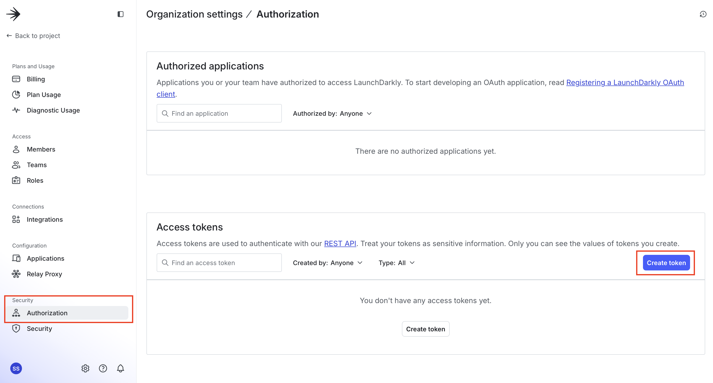
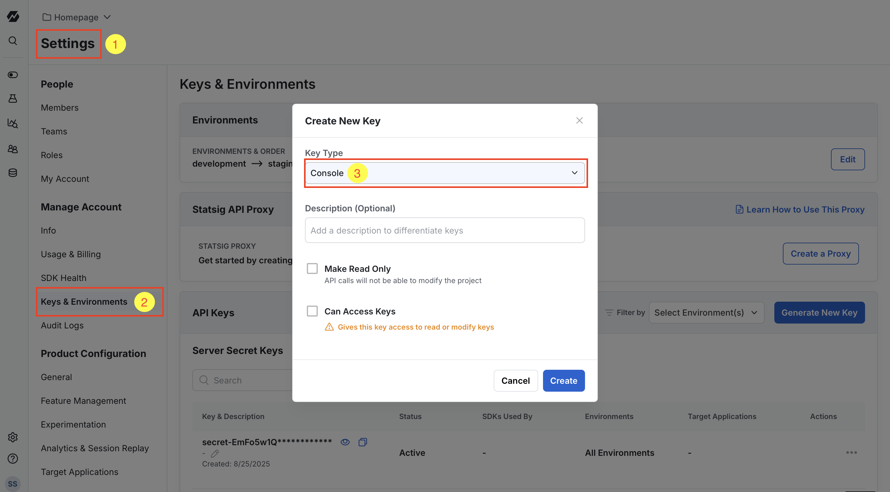
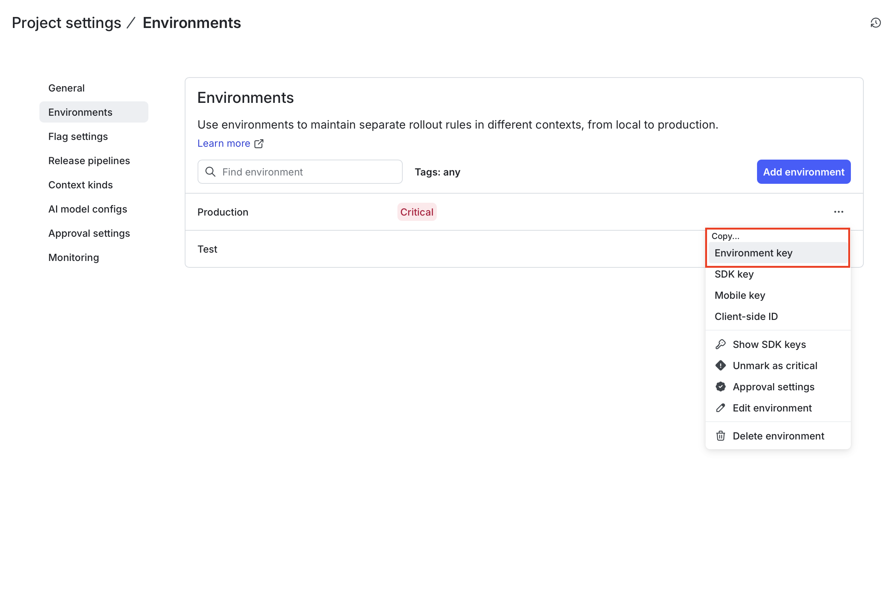
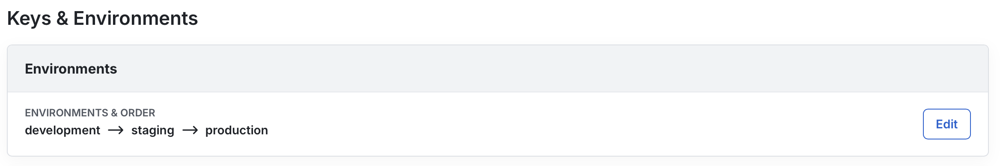

# Statsig Migration

This package is designed to help automate migration of feature flags from LaunchDarkly to Statsig. It fetches feature flags from LaunchDarkly, translates them into Statsig's format, and creates corresponding feature gates in Statsig.

## Considerations

This script should work out of the box. It's recommended you getting started with a test environment of 5-10 flags. However, before running the script on a large scale, consider the following:

- **IMPORTANT**: If you don't want/need to customize this import script, you may consider using our [in-console migration tool](https://docs.statsig.com/guides/migrate-from-launchdarkly).
- The script uses a tag (`Imported from LaunchDarkly`) to identify migrated flags in Statsig. Ensure this tag is unique and recognizable.
- The script includes a function to delete all Statsig feature gates with a specific tag. Use this with caution to clean up after a test or failed migration.
- The script requires API keys for both LaunchDarkly and Statsig, which should be kept secure.

- **Environments**: In Statsig, the hierarchy is designed with a single project that contains multiple environments, such as Development, Staging, and Production. Conversely, LaunchDarkly adopts an Environment > Project hierarchy, where each environment can be considered a separate project with its own set of feature flags. You can configure the environment mapping as part of this script's execution. Here's an example of a flag which is only on in development, which was imported using the current migration script: 

## Running

To run the script out of the box, you need Node.js and npm installed on your system. You can execute directly:

```
npx @statsig/migrations --from launchdarkly --launchdarkly-project-id default <more-arguments>
```

To customize the script, can clone this repo and make changes locally. To run it locally:

```
npm dev --from launchdarkly --launchdarkly-project-id default <more-arguments>
```

## Configuration

### API keys

Before running the script, you need API keys for LaunchDarkly and Statsig. You can set this as part of running the script:

```
STATSIG_API_KEY=console-xxx LAUNCHDARKLY_API_KEY=api-yyyy npx @statsig/migrations --from launchdarkly --launchdarkly-project-id default <more-arguments>
```

#### Getting your LaunchDarkly API Key
To generate a LaunchDarkly API key, go to **Account settings** → **Authorization** → **Access tokens** ([docs](https://launchdarkly.com/docs/home/account/api-create))



#### Getting your Statsig Console API Key
To generate a Statsig Console API key, go to **Settings** → **Keys & Environments** → **Console API** ([docs](https://docs.statsig.com/sdk-keys/api-keys/))



### Environment mapping

To map LaunchDarkly environments to Statsig environments that aren't already the same, provide `--environment-key-mapping` to the script. E.g.

```
npx @statsig/migrations --environment-key-mapping test=development --environment-key-mapping internal=staging
```

If you want to only import for a specific environment, use `--only-environment`. E.g.

```
npx @statsig/migrations --only-environment production
```

#### Getting your LaunchDarkly Environment Keys

You'll also need the environment keys for the specific LaunchDarkly project you want to migrate from. You can find this in your LaunchDarkly project settings:



#### Getting your Statsig Environment Keys

You'll also need the Statsig environment keys. You can find this in the same **Keys & Environments** section (in Statsig, environment name and key is same):



### Context kind mapping

LaunchDarkly context kinds do not exist in Statsig the same way. Context kind keys can be mapped to Statsig's unit ids (see [docs](https://docs.statsig.com/guides/experiment-on-custom-id-types/)). The default user context kind is automatically mapped to the built-in `user_id` in Statsig. Use `--context-kind-to-unit-id` to map any custom context kinds. The Statsig unit id needs to exist in Statsig already.

```
npx @statsig/migrations --context-kind-to-unit-id device=device_id
```

(Optional) Context kind attributes can be mapped to Statsig's custom fields (see [docs](https://docs.statsig.com/feature-flags/conditions/#custom)). Use `--context-attribute-to-custom-field` to map any custom context kind attributes. The Statsig `custom fields` do not need to exist in Statsig before you run the script. If you don't provide a mapping for a context kind attribute, we will create them using heuristic. For example, `location` attribute of context kind organization will be mapped to `organization.location`.

```
npx @statsig/migrations \
  --context-attribute-to-custom-field device/manufacture=device_manufacture \
  --context-attribute-to-custom-field device/mobile=device_mobile
```

## Running the Script

The script will perform the following actions:

1. Fetch all feature flags from LaunchDarkly for each provided project key.
2. Translate each flag into Statsig's format.
3. Show a preview of everything that can be imported automatically, and anything that cannot.
4. Create feature gates in Statsig in the project associated with your console API key.

## Example Translations

This LaunchDarkly feature flag:


Would be translated to this Statsig feature gate:


And this LaunchDarkly feature flag:


Would be translated to this Statsig feature gate:


## Troubleshooting

If you encounter issues during the migration, check the following:

- Ensure that the API keys are correct and have the necessary permissions.
- Review the error messages in the console for clues on what might have gone wrong.

Pull requests and feedback welcome!
